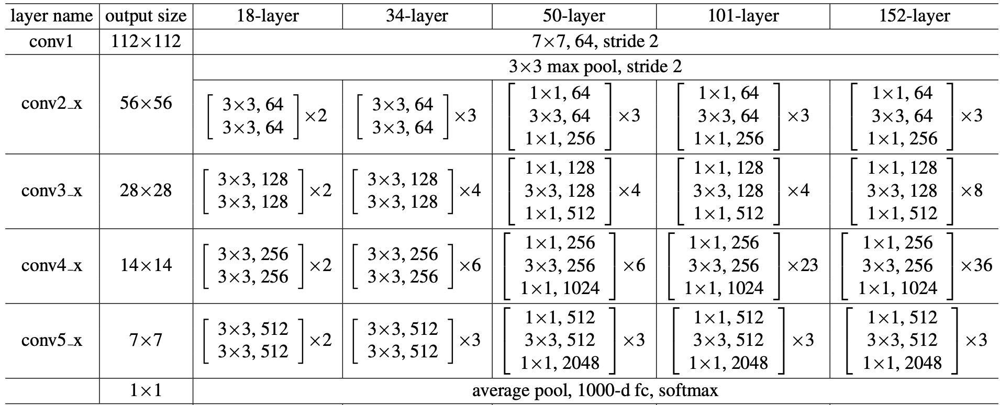

# Who am I
- name: **Xiaonan Fu**
- pronouns: He/Him
- Current year: Junior
- Current major: Cognitive Science

## section links
- [Who am I](#who-am-i)
  - [section links](#section-links)
  - [relative links](#relative-links)
- [Recent Projects](#recent-projects)
- [Favorite Programming Languages](#favorite-programming-languages)
- [What I want to learn](#what-i-want-to-learn)

## relative links
- [README.md](./README.md)

# Recent Projects
- [COGS 181 Final Project, ResNet Visualization](https://xiaonanfu-ucsd.github.io/resnet-visualization/)



# Favorite Programming Languages
1. C++
2. Javascript/Typescript
3. Python

```python
def hello_world():
    print("Hello World!")
```

> Electron is an open source project maintained by the OpenJS Foundation and an active community of contributors.

# What I want to learn
- [x] How to use git
- [x] Electron
- [ ] Vue.js